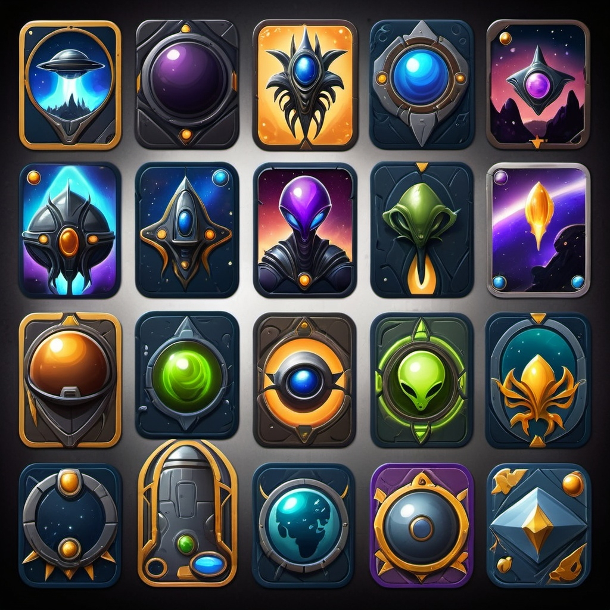
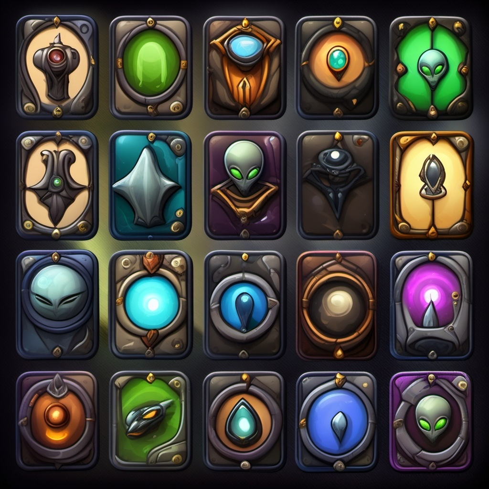
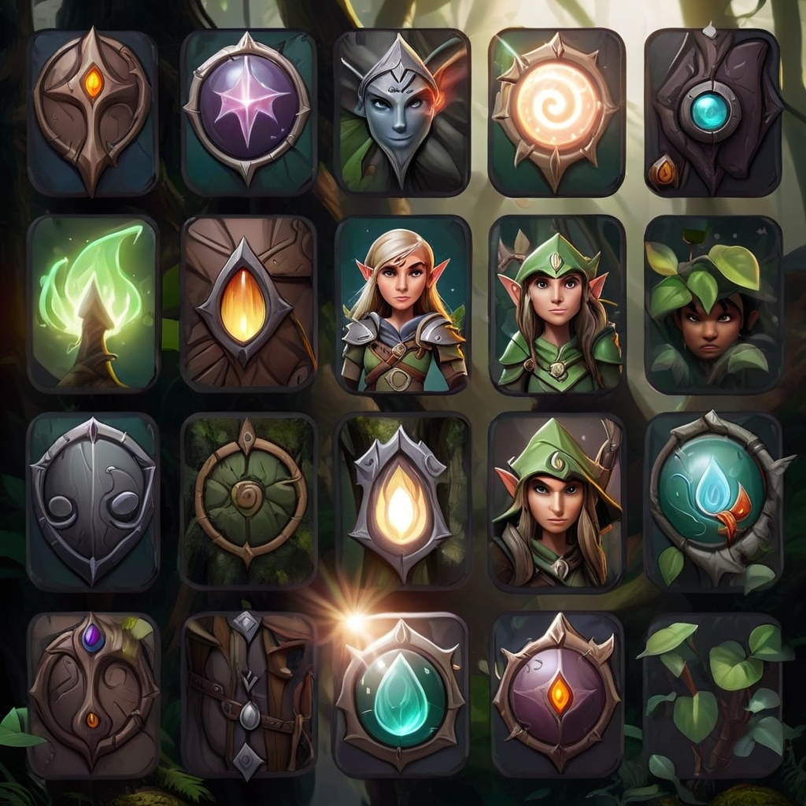
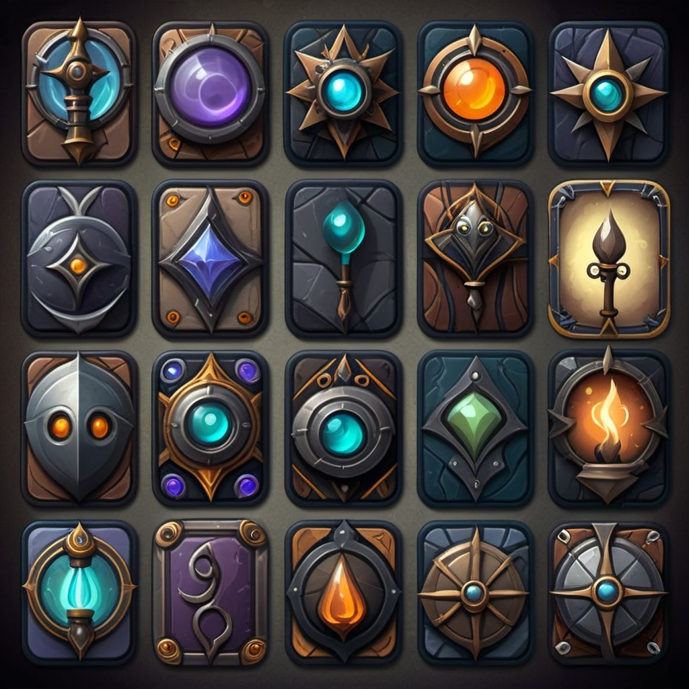
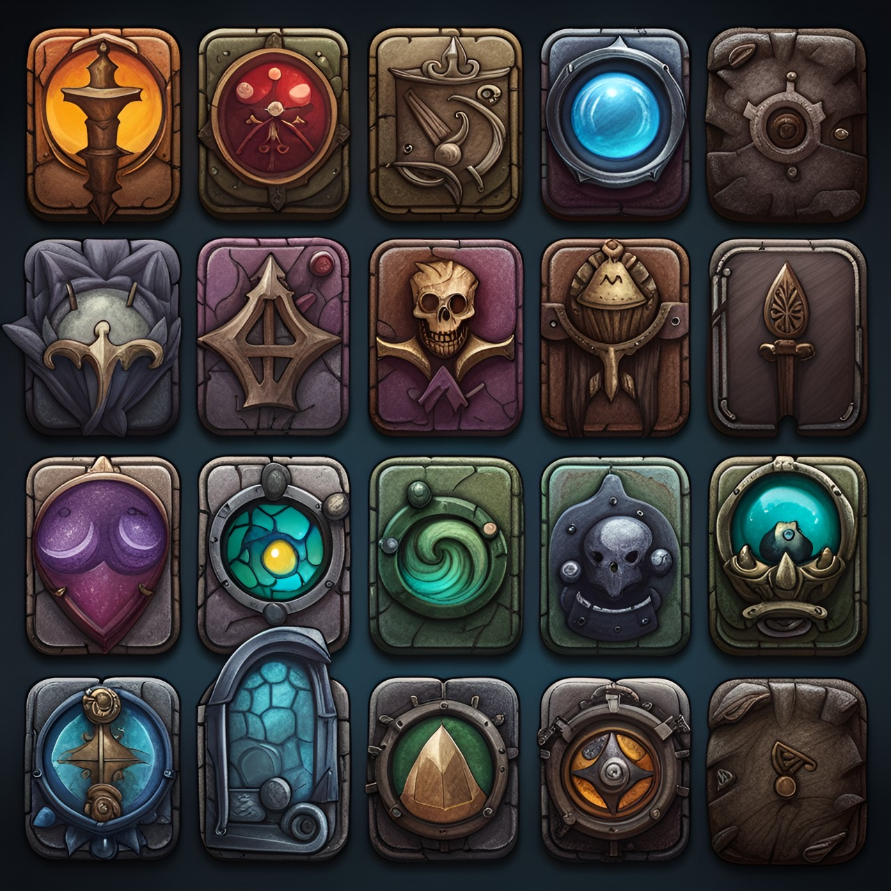
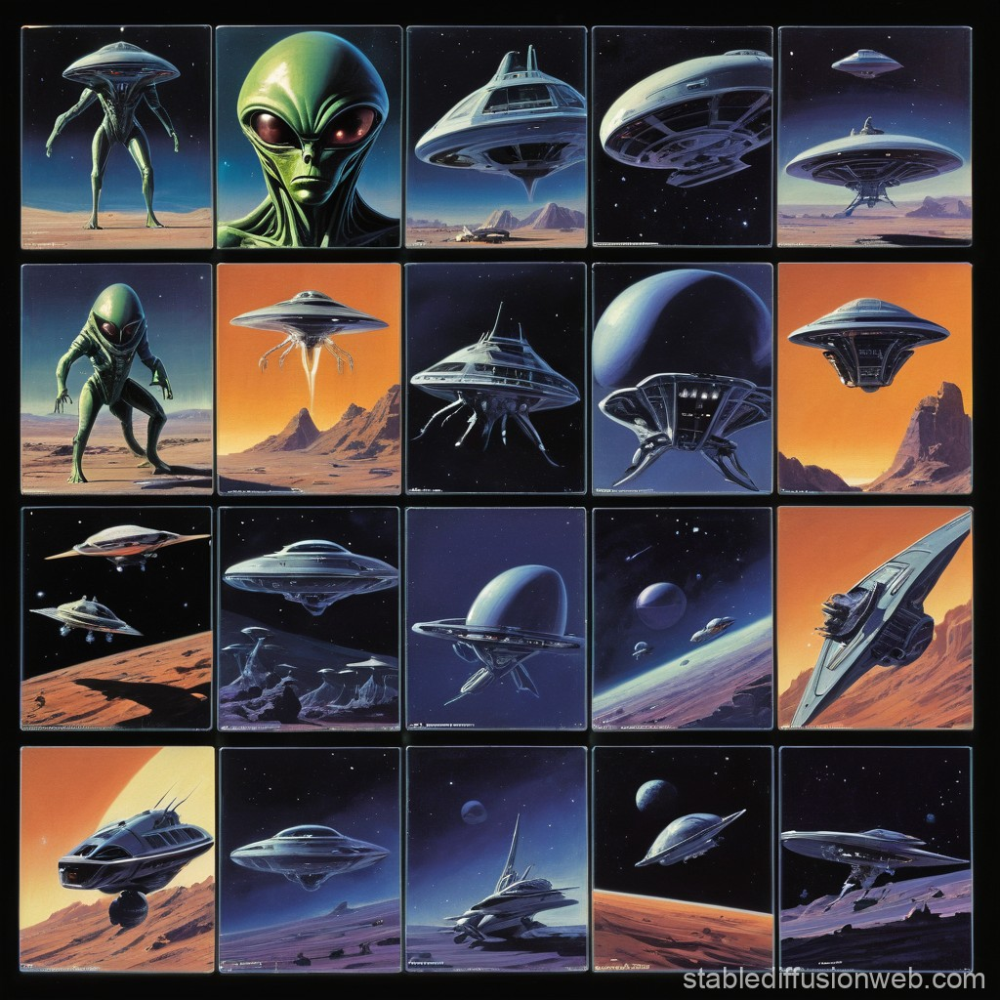

# Prepare for Hackhathon

## Login System With Markdown Editor

How much fun if the login system is a markdown editor,
until you fulfill the right code block, you can't login
to the game.

You can use `Marker` on minimal functionality or even worst.

> Wors idea is the `B A D - M A R K E R` which is editor, but turn to something else. Maybe insert a sarcastic or enigmatic remark to your code.

If try to change the skin to ligth then it is change a darker skin and everything will be much more scary. Even sometimes you can play minigame inside in some block.

The possibilities near endless.

> Maybe it is a evil paralell editor ( scary thing is open AI answer )

## 3D animations of cards

```js
document.querySelector('.card-front').style.transform=`
  translateX(13rem)
  translateZ(15rem)
  translateY(37rem)
  rotateY(45deg)
`;
```

## Game Ideas
- 3rd person tabletop game
- rotation puzzle, with functions
- card based tabletops:
  - star trader
  - fantasy explorer
  - emoji deep state
  - archeologist adventure
  - exotic animal photographer
  -math function card party
  - score gladiator
  - card controlled raid run
- elevator game
- idle game
- hero wars: puzzle movement
- dungeon crawler: lands of lore, with secret pass
- CCG Board: pirates sea trader, puzzle shape table elements
- item evolving game
- merge game
- story board game
- pet manager
- roll caster tycoon
- builder game
- dark space scientic evolution, black business, duty manager
- minecraft mixed jenga
- crime game
- post apocaliptic survivor game
- pub manager
- spaceship survive on lost spaceship
- cookie merger




## Live preview is awesome

After added two line of code to my app, it is immediatley transform to something else. A greatest portal stuff which is ever created:

```
// move to outside of and you have a mindblow draw program


// Jupiter notebook online

```

## Notebook
Maybe I can create a `jupiter notebook` like solution example,
but for this need to be make a server solution.
Plus do not forget to make section to avoiding rerender
output code plus iframe every typing.

> maybe JS code can I run with simple `Function`

```
''''test.html <-- indicate editor block with file name
<script src="old-bird-soft.js" type="module"></script>
<main class="min-h-screen bg-zinc-950 text-zinc-400">
  <section class="max-w-screen-2xl m-auto grid grid-cols-1 gap-2 lg:grid-cols-2">
    <textarea
    class="bg-zinc-800 text-zinc-400 focus:outline-none p-8 placeholder-zinc-600"
    placeholder=" - - - markdown editor - - - "
    spellcheck="false"
    ></textarea>
    <article class="bg-zinc-900 whitespace-pre-wrap px-8
      min-w-full min-h-screen relative
    ">
      <span id="debug-ms" class="absolute top-4 left-4 p-2 rounded-lg bg-neutral-950"></span>
      <markdown-view source="textarea" />
    </article>
  </section>
</main>
''''

// here is the running example

    /-----------------------\
    |                       |
    |                       |
    |                       |
    |                       |
    \-----------------------/
```



## Gallery

```sh
// make
lll > gallery.md
// rework to  format with proper relative path
```















## Star Tabletop Game
One image can be describe somethin better, than 1000 word.


```
// my gallery

```